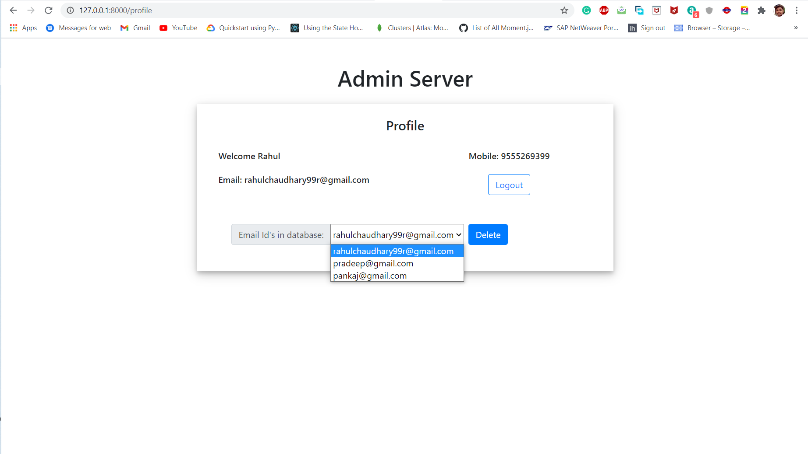

# server_task1

This document will guide you how you can run this project.

- Clone the project to you system

  ```bash
  git clone https://github.com/rahul-vedant/server_task1.git
  ```

- Install all requirements

  ```bash
  pip install Django==3.1.3
  pip install mysql-connector==2.2.9
  pip install mysqlclient==2.0.1
  ```

- Switch to the path `server_task1/server/`

  ````bash
  cd server_task1/server
  ````

- run migration

  ```bash
  py manage.py sqlmigrate admin_app 0001_initial
  ```

  ```bash
  py manage.py migrate
  ```

  Note: Make sure MySQL should be installed in the system.

- Run Server

  ```bash
  py manage.py runserver
  ```


## Screenshots:

Login page


Signup page


Profile page

